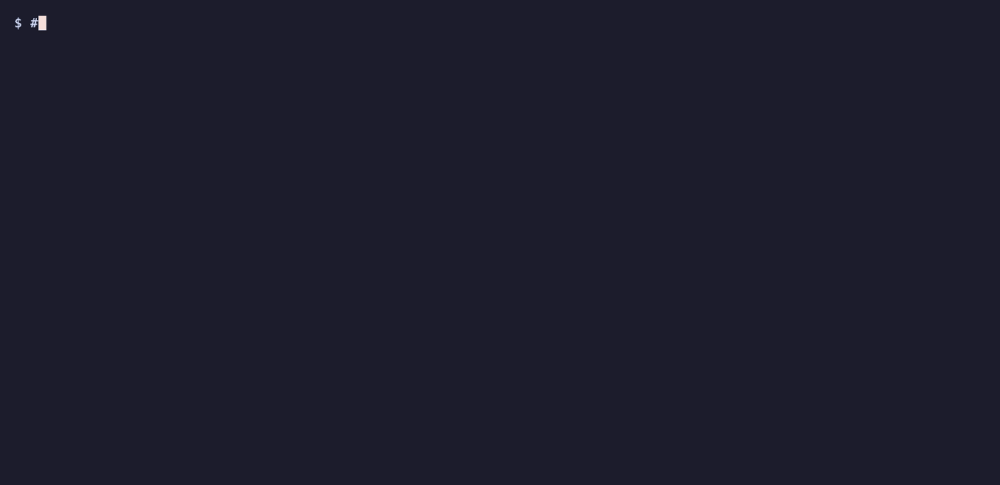

<div align="center">

# skenv

**One manifest, the same agent skills on every machine.**

**[Documentation site: qunaxis.github.io/skenv](https://qunaxis.github.io/skenv/)**

[Install](#install) • [Getting started](#getting-started) • [Documentation](#documentation) • [Contribute](#contribute)

[](https://github.com/qunaxis/skenv/releases/latest)
[](https://github.com/qunaxis/skenv/actions/workflows/ci.yml)
[](go.mod)



</div>

---

## Table of contents

- [Introduction](#introduction)
- [Features](#features)
- [Prerequisites](#prerequisites)
- [Install](#install)
- [Getting started](#getting-started)
- [Documentation](#documentation)
- [Roadmap](#roadmap)
- [Contribute](#contribute)

## Introduction

<!-- #region introduction -->
Agent skills pile up fast: some you write yourself, some you borrow from
other people's repositories, and each agent keeps them in its own
directory. Copying them by hand between Claude Code, Codex and pi, on a
laptop, a desktop and a server, drifts within a week.

`skenv` keeps the agent skills on a machine in sync with a declarative
manifest (the `[environment]` section of `skenv.toml`) that lives in a git
repository you own. Run
`skenv sync` on any machine and it ends up with the same skills, linked
into every agent that is installed there.

- **Own skills** live in git repositories you work in; skenv clones them and
  fast-forwards clean working copies.
- **Vendored skills** from other people's repositories are pinned to a full
  commit SHA and copied into the store.
- Everything is linked into each agent's skills directory.

Its design is guided by these mantras:

- **Declarative and pinned.** The manifest is the truth. Third-party skills
  are pinned to a full commit SHA, `sync` is idempotent, and upgrading a
  skill is an explicit `skenv vendor update` that shows you the log.
- **Never touch what you don't manage.** skenv records every path it
  creates and only ever replaces or removes those. Anything else is reported
  by `skenv doctor` and left alone unless you pass `--adopt`, which backs it
  up first.
- **Look before you leap.** `skenv doctor` and `--dry-run` change nothing;
  they tell you what `sync` would do.
- **Only `git` at runtime.** No daemon, no service, no registry. skenv uses
  your normal git authentication (ssh key or credential helper) for private
  repositories.
- **Your layout, your names.** skenv hardcodes neither the name of your
  skills repository nor where you keep it. There is no default manifest
  location: you point skenv at yours once with `skenv init`.
<!-- #endregion introduction -->

## Features

- Sync own skills (git working copies) and vendored skills (pinned copies)
  from one manifest into Claude Code, Codex and pi.
- `skenv doctor` compares the machine with the manifest and classifies every
  discrepancy (missing, conflict, wrong-rev, dirty, unpushed, …), as text or
  JSON.
- `skenv vendor add|update|remove` edit the manifest in place, keeping its
  comments and order, in TOML, YAML or JSON.
- JSON Schemas for the skenv file and the tool config: files skenv writes
  name their schema, so editors complete and check them
  ([editor support](docs/editor-support.md)).
- A selection of skills per own repository (`skills`, `exclude`), per-host
  skips, custom agent directories, and ignore patterns for skills owned by
  other tools.
- `skenv autostart` runs `sync` at login and hourly via launchd or systemd.
- `skenv lint` checks skills against the Agent Skills rules (L1–L6) and,
  with `--publish`, runs a publication check before a skill goes public.
- `skenv new` scaffolds a skill in the right repository and lints it.
- `skenv repo` generates and verifies a versioned harness for skills
  repositories: lefthook hooks, a CI workflow, linter configs and a Claude
  Code hook that lints skills as the agent edits them.

## Prerequisites

- **Required:**
  - `git`
  - macOS or Linux, on amd64 or arm64
- **Agents** (skenv links into those that are installed):
  - [Claude Code](https://docs.anthropic.com/en/docs/claude-code):
    `$CLAUDE_CONFIG_DIR/skills`, else `~/.claude/skills`
  - [Codex](https://github.com/openai/codex): reads the store
    `~/.agents/skills` directly
  - pi: `~/.pi/agent/skills`
- **Optional:**
  - [`gh`](https://cli.github.com), logged in, for the install one-liner
  - Go 1.27.1 or newer, for `go install`
  - [lefthook](https://github.com/evilmartians/lefthook), for
    `skenv repo init|apply`, and
    [gitleaks](https://github.com/gitleaks/gitleaks), for
    `skenv lint --publish`

## Install

<!-- #region install -->
Pre-built binaries for darwin/linux × amd64/arm64 are attached to every
[GitHub release](https://github.com/qunaxis/skenv/releases). Archives are
named `skenv_<version>_<os>_<arch>.tar.gz`, for example
`skenv_0.3.0_darwin_arm64.tar.gz`, and contain the `skenv` binary and
its man pages in `man/`. To install the latest binary into `~/.local/bin`:

```sh
mkdir -p ~/.local/bin
gh release download -R qunaxis/skenv \
  -p "skenv_*_$(uname -s | tr A-Z a-z)_$(uname -m | sed -e s/x86_64/amd64/ -e s/aarch64/arm64/).tar.gz" -O - \
  | tar xz -C ~/.local/bin skenv
```

`~/.local/bin` must be on your `PATH`. With Go installed you can use this
instead:

```sh
go install github.com/qunaxis/skenv/cmd/skenv@latest
```

The man pages (`man skenv`, `man skenv-vendor-add`, …) go into
`~/.local/share/man/man1`, which `man` searches when `~/.local/bin` is on
your `PATH`:

```sh
tmp="$(mktemp -d)"
gh release download -R qunaxis/skenv \
  -p "skenv_*_$(uname -s | tr A-Z a-z)_$(uname -m | sed -e s/x86_64/amd64/ -e s/aarch64/arm64/).tar.gz" -O - \
  | tar xz -C "$tmp"
mkdir -p ~/.local/share/man/man1
cp "$tmp"/man/*.1 ~/.local/share/man/man1/
rm -rf "$tmp"
```

From a checkout, `make man` writes the same pages into `man/`.

Then bootstrap the machine from your skills repository, the one whose
`skenv.toml` has the `[environment]` section:

```sh
cd ~/src                        # any directory; the clone lands in ./<skills-repo>
skenv init <owner>/<skills-repo>
skenv autostart enable          # sync at login and hourly
```

`skenv init` clones the repository into the current directory (like
`git clone`) or into `--path`, records the manifest location in
`~/.config/skenv/config.toml` and runs `sync`. If the repository is already
cloned, point `--path` at it: `skenv init <owner>/<skills-repo> --path ~/src/my-skills`.

> [!WARNING]
> **Upgrading from v0.3.0 or earlier:** `env.toml` and the old
> `skenv.toml` are no longer read. First move them into one `skenv.toml`
> with `[repo]` and `[environment]` sections, as described in
> [moving from `env.toml`](docs/skenv-file.md#moving-from-envtoml-and-the-old-skenvtoml).
> skenv also has no built-in default manifest location: record your
> checkout once with `skenv init <owner>/<skills-repo> --path <checkout>`;
> an existing clone is not touched, only its skenv file is recorded.
<!-- #endregion install -->

## Getting started

<!-- #region getting-started -->
The manifest is the `[environment]` section of `skenv.toml` at the root of
your skills repository ([the skenv file](docs/skenv-file.md) also holds the
repository harness in `[repo]`). No manifest yet? Start one in your skills
repository; skenv writes the section and records the file as your manifest:

```sh
cd ~/src/<skills-repo>
skenv init                 # or: skenv init --format yaml (json)
```

A minimal manifest lists the repository itself, so skenv keeps its working
copy up to date (`skenv init` adds this entry when the repository's `origin`
is on GitHub):

```toml
[[environment.own]]
repo = "<owner>/<skills-repo>"
path = "~/src/<skills-repo>"
```

> [!IMPORTANT]
> Set `path` to where the repository is cloned (`skenv init` from `~/src`
> puts it in `~/src/<skills-repo>`). Otherwise `sync` clones a second
> working copy at `path` and links the skills from there.

The full format is in [docs/manifest.md](docs/manifest.md). A typical first
session on a machine:

```sh
# 1. Point skenv at the manifest, clone the repository, sync.
skenv init <owner>/<skills-repo>

# 2. The machine already had skills? Back up the conflicting ones and take over.
skenv sync --dry-run
skenv sync --adopt

# 3. Check that the machine matches the manifest (exit 0: in sync).
skenv doctor

# 4. Pin a third-party skill; skenv edits skenv.toml and prints the commit command.
skenv vendor add <owner>/<repo> --path <skill-dir>

# 5. Scaffold your own skill in the private skills repository and lint it
#    (the repository needs a harness, see below).
skenv new my-skill
```

Commit the changes to `skenv.toml` and your new skill as usual; every other
machine picks them up on its next `skenv sync` (or within the hour, with
autostart). Later, `skenv vendor update` moves your vendored skills to new
commits and shows what changed.

`skenv new` looks for the own repository whose `[repo]` has the
requested visibility; set it up once with
`skenv repo init --visibility private` (see [docs/harness.md](docs/harness.md)),
or pass `--dir` to target any git repository.
<!-- #endregion getting-started -->

## Documentation

The same pages, with search, are published at
<https://qunaxis.github.io/skenv/>.

- [Commands](docs/commands.md): every command and flag, `--dry-run` and
  `--adopt`, `doctor` classes, lint rules and the publication check.
- [Command reference](docs/commands/README.md): one page per command,
  generated from the command definitions by `make docs`.
- [The skenv file](docs/skenv-file.md): `skenv.toml` with its `[repo]` and
  `[environment]` sections, formats, and moving from `env.toml`.
- [Editor support](docs/editor-support.md): JSON Schemas of the skenv file
  and the tool config, and editor setup.
- [Manifest](docs/manifest.md): the `[environment]` format, where it is found,
  the layout on disk, and the mapping to `skills-lock.json`.
- [Harness](docs/harness.md): `skenv repo init|apply|check`, `[repo]`,
  the managed files and harness versions.
- [Claude Code hook](docs/claude-code-hook.md): how skills are linted while
  an agent edits them.
- [Development and releases](docs/releasing.md): `make` targets, commit
  rules, versioning and cutting a release.
- [Changelog](CHANGELOG.md).

`skenv --help` and `skenv <command> --help` print the same reference in the
terminal. `skenv completion bash|zsh|fish` prints a shell completion
script (for example `skenv completion zsh > "${fpath[1]}/_skenv"`).

## Roadmap

Done:

- **v0.1** — `env.toml`, `sync`, `link`, `init`, `doctor`, `vendor
  add|bump|remove`, `autostart`.
- **v0.2** — `skenv lint` (L1–L6), the skills-repository harness
  (`skenv repo`), `layout.ignore`.
- **v0.3** — the publication check (`lint --publish`), the Claude Code hook,
  `skenv new`, harness 0.3.0.

Being considered next, in no particular order and with no dates:

- a Homebrew tap;
- stabilising the manifest format and the CLI for 1.0.

## Contribute

<!-- #region contribute -->
Issues and pull requests are welcome.

- Commits follow [Conventional Commits](https://www.conventionalcommits.org/en/v1.0.0/)
  in English, with a body that explains why. `make hooks` installs the
  lefthook `commit-msg` check; CI checks every commit of a pull request.
- Run `make check` before pushing: go vet, staticcheck, golangci-lint,
  `go test -race` and the commit check.
- Tests use a temporary `$HOME` and local bare repositories; never run
  `sync`, `link`, `init` or `autostart` against a real home directory from
  tests.
- Coding agents: read [AGENTS.md](AGENTS.md).
- Releases are cut with `make release` only; `CHANGELOG.md` is generated.
  See [docs/releasing.md](docs/releasing.md).
<!-- #endregion contribute -->
